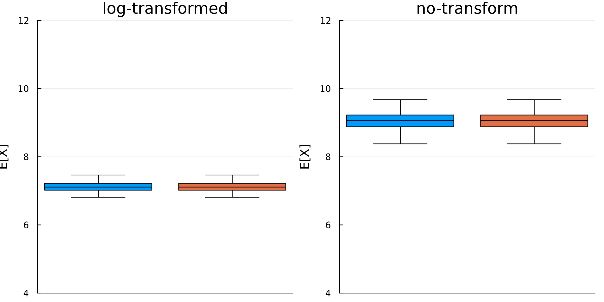
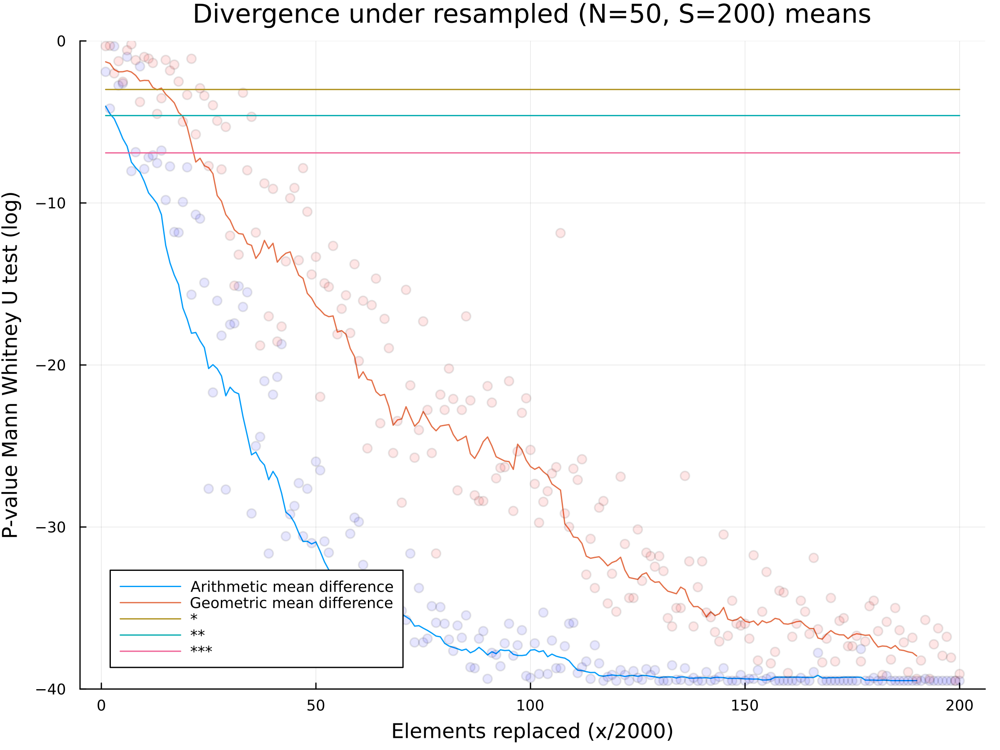
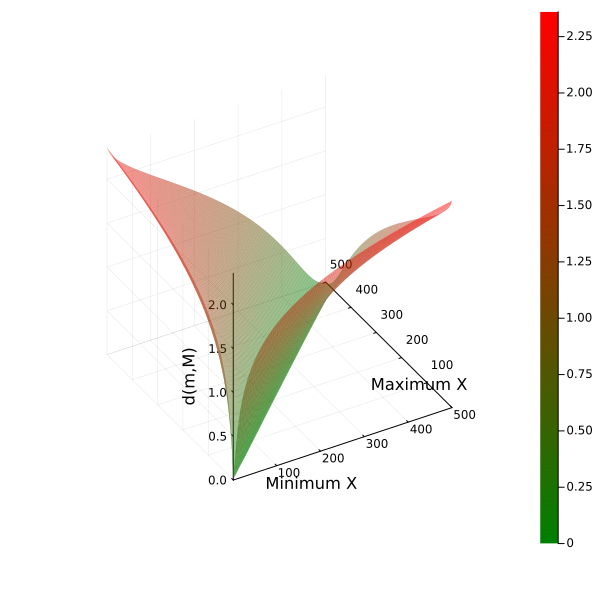
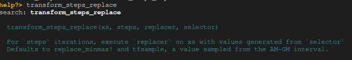

# LogParadox

A project to illustrate how you can obtain paradoxical pattern inversions when applying hypothesis tests, conditional on a log transform of your data.


[](https://doi.org/10.5281/zenodo.7545842)


[](https://codecov.io/gh/bencardoen/LogParadox.jl)

[](https://dl.circleci.com/status-badge/redirect/gh/bencardoen/LogParadox.jl/tree/main)

## Motivating Minimal Reproducible Example
Suppose you're comparing two vectors of data, X, and Y. This example shows we can find Y such that
* E[X] > E[Y],
yet
* E[log(X)] <  E[log(Y)].

In other words, there exist distributions, especially in long tail data, where **small** differences between the 2 datasets can induce a 'X is greater than Y' conclusion, yet in log scale, report a 'X is smaller than Y' conclusion.
We show that you can get this effect with X differing from Y in as little as 5%.
In the image below X is in blue, and we find Y by replacing a small percentage of X.

The necessary and sufficient conditions are derived in the paper, but our API allows you to test to see if you data is vulnerable or not, and when.




### Effect on significance testing
Using a non-parametric hypothesis test, at 5% of data modified, you can induce a strong inversion effect consistently achieving significance.

Note that this does not try to reinforce the flawed idea that significance in isolation is sufficient to publish, rather serve as a cautionary tale that inducing significant inversions is fairly easily accomplished.

In the below figure we compare X and Y, where Y is obtained by iteratively replacing elements in X.
We report the significance (p-value) of the Mann Whitney U-test (Y-axis, log scale), with the three common reference values plotted as horizontal lines.
As you can observe, a x=25, both geometric and arithmetic means are changed at α=0.001 (pink), and this effect only becomes stronger as the number of replacements increases.



## Installation
- Get [Julia](https://julialang.org/learning/getting-started/)
```bash
julia
julia 1.x>using Pkg; Pkg.add(url="https://github.com/bencardoen/ERGO.jl.git")
julia 1.x>using Pkg; Pkg.add(url="https://github.com/bencardoen/SPECHT.jl.git")
julia 1.x>using Pkg; Pkg.add(url="https://github.com/bencardoen/LogParadox.jl.git")
julia 1.x>Pkg.test("LogParadox")
julia 1.x>using LogParadox
```

## Usage

See [scripts](https://github.com/bencardoen/LogParadox.jl/tree/main/scripts) for example illustrations that use the API.

An example using in silico 2D image data, inspired by real datasets is found [here](https://github.com/bencardoen/LogParadox.jl/tree/main/scripts/markov.jl).

The script that generates the gif in this readme is found [here](https://github.com/bencardoen/LogParadox.jl/tree/main/scripts/gif.jl), and illustrates how the paradoxical comparison can be induced.

An example of inducing the paradox in combination with hypothesis testing is found [here](https://github.com/bencardoen/LogParadox.jl/blob/main/scripts/mwu.jl).

Code for the a plot that shows you the effect of symmetric tails can be found here [here](https://github.com/bencardoen/LogParadox.jl/blob/main/scripts/mesh.jl).

Here we plot what happens to the intermean distance `d(m, M)` in function of m(inimum) and M(aximum).



### Minimal example with API
```julia
using LogParadox, Distributions
Random.seed!(42)
xs = randexp(1000)*1000 .+ 10
ys = transform_steps_replace(xs, 100)
@assert gm(xs) < gm(ys) < am(ys) < am(xs)
```
The `gm` and `am` functions compute the geometric and arithmetic mean, the transform function iteratively changes the input array `xs` to induce the paradox.
All functions in the module have docstring, so to access these you can do in a julia REPL:
```julia
using LogParadox
?transform_steps_replace
```
which would look something like this



## Troubleshooting
If you have any comments, issues, problems, or suggestions, please create an issue with reproducible description of the problem at hand.

## Cite
```bibtex
@software{ben_cardoen_2023_7545842,
  author       = {Ben Cardoen and
                  Hanene Ben Yedder and
                  Sieun Lee and
                  Ivan Robert Nabi and
                  Ghassan Hamarneh},
  title        = {LogParadox},
  month        = jan,
  year         = 2023,
  publisher    = {Zenodo},
  doi          = {10.5281/zenodo.7545842},
  url          = {https://doi.org/10.5281/zenodo.7545842}
}
```
